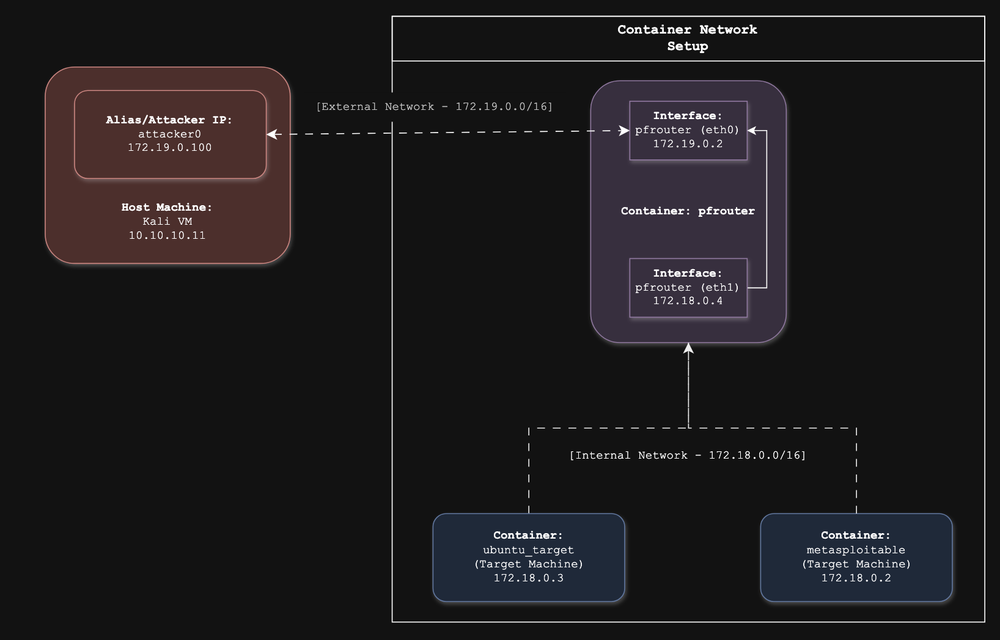
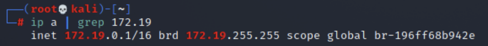

# Tools & Setup Guide

This guide goes over how to setup your environment for the Chisel Mini-lab. 

- [Update Kali's GPG Key](#1-update-kali-machines-gpg-key)
- [Install Docker & Docker Compose](#2-install-docker--docker-compose-on-kali)
- [Chisel Setup](#3-chisel-setup---kali-machine)
- [Target Setup](#4-target-setup---ubuntu_target)
- [Attacker Setup](#5-attacker-setup---attacker0-on-kali)
- [Firewall Setup](#6-firewall-setup---pfrouter)
- [Testing Setup](#7-testing-setup)
- [References](#references)

---


This is the environment that we are setting up for the mini-lab. We have a container network that contains three containers:
- `pfrouter` simulates a pfSense-style firewall
- `ubuntu_target` simulates an internal Ubuntu machine
- `metasploitable` simulates a vulnerable internal system using Metasploitable

The internal network, managed by pfrouter, is configured to allow all outbound connections but deny all inbound connections. This means an external machine, like `attacker0` will not be able to establish a connection to the machines inside of the internal container network. This is where Chisel tunneling becomes essential.

> Want to see how it's done? Check out this video: 
>https://youtu.be/uH2JyZhIm3s

After setup, continue to [`MINI-LAB.md`](MINI-LAB.md) for a walkthrough on using the Chisel tool.

## 1. Update Kali Machine's GPG Key

For our Proxmox VM's, we will need to update Kali's repository signing to use `apt update`: 

```bash
curl -fsSL https://archive.kali.org/archive-key.asc | sudo tee /etc/apt/trusted.gpg.d/kali-archive-key.asc 

sudo apt update 
```

## 2. Install Docker & Docker Compose on Kali

Although it is not completely up-to-date, we will be installing `docker.io` instead of the most recent `docker` because `docker.io` is maintained by the Linux distribution. Install it by issuing:
```bash
sudo apt install -y docker.io 
```

When you run this command, it may lock you out of the Kali GUI login screen. If this is the case, you will need to switch to a text-based terminal, or TTY, by pressing `Ctrl + Alt + F2` on **Windows** or `fn + control + option + F2` on **Mac**. Now that you have terminal access, you should be able to log in with your Kali username and password and restart the system services that were broken.
```bash
sudo systemctl restart dbus
```

Switch back to the GUI login screen by pressing `Ctrl + Alt + F1` on **Windows** or `Fn + Ctrl + Option + F1` on **Mac**. If that does not work, use `F1` – `F7` to cycle screens until you see the log in screen. Log in again. Once the system has finished booting back up, open a terminal inside of Kali and run: 
```bash
sudo systemctl enable docker 

sudo systemctl start docker 
```

We need to install the latest version of `docker compose`:  
```bash
sudo curl -L "https://github.com/docker/compose/releases/latest/download/docker-compose-$(uname -s)-$(uname -m)" -o /usr/local/bin/docker-compose 

sudo chmod +x /usr/local/bin/docker-compose 

docker-compose --version 
```
 


## 3. Chisel Setup - Kali Machine

We need to install Chisel on the Kali machine.  
```bash
wget https://github.com/jpillora/chisel/releases/download/v1.8.1/chisel_1.8.1_linux_amd64.gz 

gunzip chisel_1.8.1_linux_amd64.gz 

mv chisel_1.8.1_linux_amd64 chisel 

chmod +x chisel 

sudo mv chisel /usr/local/bin/ 
```
 

 

Setting Up Containers on Kali 

We are going to use a `yml` file to define the network and network devices. This will allow us to simulate internal and external machines and a **pfSense**-like firewall. Use spaces when indenting, do not use tabs. Use `nano` to access and edit the file: 
```bash
nano docker-compose.yml 
```

Paste this into the file: 
```yml
version: "3.8"

networks: 
  attacker_net: 
    driver: bridge 
  internal_net: 
    driver: bridge 

services: 
  ubuntu_target: 
    image: ubuntu:20.04 
    container_name: ubuntu_target 
    hostname: ubuntu_target 
    command: sleep infinity 
    tty: true 
    stdin_open: true 
    privileged: true 
    networks: 
      - internal_net 

  metasploitable: 
    image: vulnerables/web-dvwa 
    container_name: metasploitable 
    hostname: metasploitable 
    restart: always 
    privileged: true 
    networks: 
      - internal_net 

  pfrouter: 
    image: ubuntu:20.04 
    container_name: pfrouter 
    hostname: pfrouter 
    command: sleep infinity 
    tty: true 
    stdin_open: true 
    privileged: true 
    networks: 
      - attacker_net 
      - internal_net 
```
Save and exit by pressing `CTRL+O`, `Enter` and then `CTRL+X`. 


Test your work by running:  
```bash
docker-compose up -d 

docker ps -a  
```
 

To access each container, you will need to issue the following command: 
```bash 
docker exec -it <container-name> bash 
```


Examples: 
```bash
docker exec -it pfrouter bash 

docker exec -it ubuntu_target bash 

docker exec -it metasploitable bash 
```

 
Since the containers are running a minimal Ubuntu image, they do not have all networking tools by default. We can use the `ip a` command to find the IP address of the **pfrouter** and **ubuntu_target** containers, but first we will need to install `iproute2`, so issue the command:  
```bash
apt update && apt install iproute2 -y  
```
List the IP addresses using the command:  
```bash
ip a 
```
 

> **DO NOT EXIT THE CONTAINERS.** 
Open new terminals for each. Exiting the containers will erase changes. 


---
It is a good idea to keep note of these IP addresses since we will be using them frequently throughout this exercise. *Please refer to this table for future commands.*

 
|                   | IP Address | Interface | Placeholder |
|---                |----------|----------|----------|
| pfrouter (internal IP)   ||eth1|`<internal-ip>`, `<internal-interface>`
| pfrouter (external IP)   ||eth0|`<external-ip>`, `<external-interface>`
| Target (internal) network         ||-|`<internal-net>`
| Attacker (external) network       ||-|`<external-net>`
| ubuntu_target (target) ||-|`<ubuntu-target-ip>`
| metasploitable (target) ||-|`<metasploitable-ip>`
| attacker0 (assigned IP)      |172.x.0.100|-|`<attacker-ip>`

---

> Note: you will not be able to fill out **attacker0** yet. 
 

## 4. Target Setup - ubuntu_target

We need to install Chisel on our **ubuntu_target** container. Switch to your **ubuntu_target** terminal and run the following commands:  
```bash
apt update && apt install wget -y 

wget https://github.com/jpillora/chisel/releases/download/v1.8.1/chisel_1.8.1_linux_amd64.gz 

gunzip chisel_1.8.1_linux_amd64.gz 

mv chisel_1.8.1_linux_amd64 chisel 

chmod +x chisel 

mv chisel /usr/local/bin/ 
```
 

You will need to install these for future use:
```bash
apt install apache2 iputils-ping curl -y 
```
 

Test `apache2` and `curl`:  
```bash
service apache2 start 

curl http://localhost 
```
 

We are going to use SSH in [`MINI-LAB.md`](MINI-LAB.md), so we will need to install and start the service. First, we will need to install SSH on the **ubuntu_target** container and use `nano` to edit the `/etc/ssh/sshd_config` file.  
```bash
apt install openssh-server nano -y 

nano /etc/ssh/sshd_config 
```

Find lines like:  
```ini
#PermitRootLogin prohibit-password 
#PasswordAuthentication yes 
```
 

Uncomment and replace them with this: 
```ini
PermitRootLogin yes 
PasswordAuthentication yes 
```
Save and exit (`Ctrl + O` and `Enter`, then `Ctrl + X`). 

 
Start `ssh`: 
```bash
service ssh start 
```

Inside the target containers, the targets are sending all their traffic through `172.x.0.1`, which is the `docker`’s built-in gateway, not your **pfrouter**. You can test this using `ip route`. This is important because the internal targets, **ubuntu_target** and **metasploitable**, can bypass the firewall. If we try to ping the internal targets’ IPs from a **Kali** root-user terminal, the `ping` will succeed. In our setup, this should not happen.  

To fix this to fit our setup simulating real-world segmentation, run these commands in the **ubuntu_target** and **metasploitable** containers:  
```bash
ip route del default 

ip route add default via <internal-ip> 
```
 

## 5. Attacker Setup - `attacker0` on Kali
Using a Kali root-user terminal in a **Kali**, we need to connect **Kali VM** to the `attacker_net` by creating an alias. Find the name of the bridge for the attacker network (`<attacker_net_name>` e.g., `root_attacker_net`): 
```bash
docker network ls 
```
We need to identify which bridge matches the `attacker_net` by running a few commands: 
```bash
docker network inspect <attacker_net_name> | grep Subnet 
```


Check which bridge has a container is in that range:  
```bash
docker network inspect <attacker_net_name> | grep IPv4Address 
```
 

Now run, with `<172.x>` as the first part of your IP:  
```bash
ip a | grep <172.x> 
```
 
You should see something like this:  

The name of the bridge is the last part of the line, starting with `br-`. Take note of the bridge name: [insert bridge name]

 

Issue this command for the next step:  
```bash
sudo apt update && sudo apt install bridge-utils 
```
 

Create a virtual interface (`attacker0`) and assign it to the bridge. This links the Kali VM to `docker`'s attacker network so that it can communicate like an external attacker. 

Issue the following commands:
```bash
sudo ip link add attacker0 type veth peer name docker0-vm 

sudo ip link set attacker0 up 

sudo ip link set docker0-vm up 
```
 

Replace `<docker-bridge-name>` with the name you found earlier:  
```bash
sudo brctl addif <docker-bridge-name> docker0-vm 
```
 

Assign an IP to your Kali VM on the Attacker network. You will need to replace `<assigned-IP>` with an IP within the same attacker Docker subnet. For example, if my attacker network `172.19.0.0/16`, then I may use `172.19.0.100`.  
```bash
sudo ip addr add <assigned-ip>/16 dev attacker0 
```
On a Kali root-user terminal, remove the route that lets **Kali** bypass the firewall:  
```bash
sudo ip route del <internal-net>/16 
```
This tells Kali to stop trying to reach `<internal-net>` through `docker`'s bridge or interface (e.g., `eth0`). 
 
Add a manual route through the **pfrouter** firewall: 
```bash
sudo ip route add <internal-net>/16 via <external-ip> dev attacker0 
```

Replace `<external-ip>` with pfrouter’s IP on `attacker_net`. This tells Kali that if it wants to talk to any target in the `<internal-net>` (`ubuntu_target` and `metasploitable`), it has to go through the firewall at `<external-ip>`, using `attacker0`.

 
## 6. Firewall Setup - pfrouter 
Switch to the **pfrouter** terminal. This is your simulated firewall. You will use `iptables` to block traffic and force a Chisel tunnel, so we will need to install and verify this:  
```bash
apt update && apt install iptables -y 

iptables -L 
```
 

Since **pfrouter** acts as the firewall between the attacker, Kali root-user, and the internal targets, **ubuntu_target** and **metasploitable**, we need to set up `iptables` rules to properly simulate a real firewall.  

First, enable IP forwarding so that **pfrouter** can route traffic between networks:  
```bash
sysctl -w net.ipv4.ip_forward=1 
```
 

Now we want to prevent the attacker from directly reaching **ubuntu_target** or **metasploitable** so that Chisel tunneling becomes necessary:  
```bash
# Flush all existing rules to ensure we are starting from a clean slate.
iptables -F 

iptables -t nat -F 

iptables -P FORWARD DROP 

 

iptables -A FORWARD -i <internal-interface> -o <external-interface> -s <internal-net>/16 -j ACCEPT 

 

iptables -A FORWARD -i <external-interface> -o <internal-interface> -d <internal-net>/16 -m conntrack --ctstate ESTABLISHED,RELATED -j ACCEPT 

 

iptables -t nat -A POSTROUTING -s <internal-net>/16 -o <external-interface> -j MASQUERADE 
```
 

To view rules:  
```bash
iptables -L -v -n 
```
 

## 7. Testing Setup

We need to test that our network setup and firewall rules are working. Using `ping` on a target from the **Kali** root-user should fail. Try pinging **ubuntu_target** from a **Kali** root-user terminal.  
```bash
ping <ubuntu_target-ip> 
```
 

Using `curl` should also fail as expected. Since you have your `apache2` server running on **ubuntu_target**, try running this from the **Kali** root-user:  
```bash
curl http://<ubuntu_target-ip> 
```
---
Continue to [`MINI-LAB.md`](MINI-LAB.md) for a walkthrough on using the Chisel tool.

## References
- https://docs.docker.com/compose/install/

- https://ubuntu.com/core/docs/docker-run 

- https://phoenixnap.com/kb/iptables-linux

